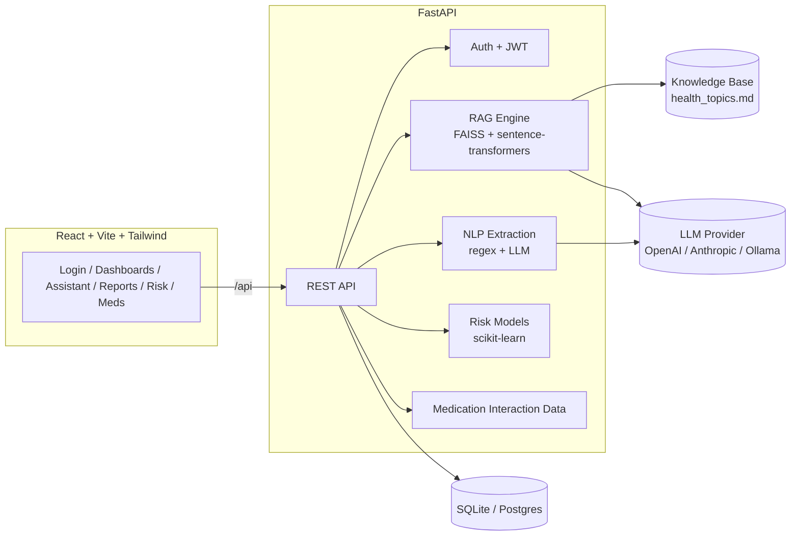

# MedVerse AI — Clinical Intelligence Platform

A full-stack healthcare AI platform centered on **Retrieval-Augmented Generation, LLMs, and NLP**: a
grounded clinical/patient assistant, medical report understanding, predictive risk scoring, and a
medication interaction checker — behind real authentication and role-based dashboards for admins,
doctors, and patients.

> **This is a portfolio/demonstration project.** It does not provide medical advice, diagnosis, or
> treatment, and should not be used to make real clinical decisions. See [Disclaimer](#disclaimer).

## Features

| Module | What it does |
|---|---|
| **Auth & roles** | JWT login/register, 3 roles (admin / doctor / patient), protected routes |
| **RAG AI Assistant** | Sentence-transformer embeddings + FAISS retrieval over a health knowledge base, fed into a pluggable LLM. Answers show their sources. Doctors can ask questions "with patient context," fusing retrieved record data into the prompt |
| **Report Understanding (NLP)** | Regex-based lab-value extraction (a real pattern-matching component, works with zero API keys) + LLM-based diagnosis/medication extraction and dual patient/clinical summaries |
| **Disease Risk Prediction** | Two real `scikit-learn` logistic regression models (diabetes, heart disease) trained on synthetic data at first run, with coefficient-based "top contributing factor" explainability |
| **Medication Interaction Checker** | Pairwise lookup against a curated set of well-established drug interactions |
| **Dashboards** | Role-aware stats and charts (admin: platform-wide; doctor: patient panel; patient: personal summary) |
| **Patient records** | CRUD medical history entries (conditions, medications, labs, visits, vaccinations) |

**Deliberately out of scope** (to keep the RAG/LLM/NLP core deep instead of shallow): medical
imaging/computer vision, wearable device integration, hospital bed/ICU management, and a mobile
app. See [Roadmap](#roadmap--natural-extensions).

## Architecture



## Tech stack

- **Frontend:** React 18 (Vite), React Router, Tailwind CSS, Axios, Recharts, lucide-react
- **Backend:** FastAPI, SQLAlchemy (SQLite by default, swap to Postgres via `DATABASE_URL`), JWT
  auth (`python-jose` + `passlib`/bcrypt)
- **RAG:** `sentence-transformers` embeddings + `faiss-cpu` vector search over an original,
  hand-written health knowledge base
- **LLM:** pluggable provider — OpenAI, Anthropic, or local Ollama. With none configured, the
  assistant still returns the most relevant retrieved knowledge-base context directly.
- **Predictive ML:** `scikit-learn` logistic regression, trained on synthetic data at first run
- **Deployment:** Docker + Docker Compose

## Quick start (Docker — recommended)

```bash
cp backend/.env.example backend/.env
# REQUIRED: set SECRET_KEY in backend/.env (the app refuses to start without one):
#   python -c "import secrets; print(secrets.token_hex(32))"
# optional: edit backend/.env to add an OpenAI/Anthropic key, or leave LLM_PROVIDER=none
docker compose up --build
```

- Frontend: http://localhost:3004
- Backend API docs (Swagger): http://localhost:8004/docs

First backend startup will train the risk models and build the RAG index automatically (the
embedding model downloads once, ~90MB).

## Quick start (manual / local dev)

**Backend**
```bash
cd backend
python3 -m venv venv && source venv/bin/activate   # Windows: venv\Scripts\activate
pip install -r requirements.txt
cp .env.example .env
uvicorn app.main:app --reload --port 8004
```

**Frontend** (in a second terminal)
```bash
cd frontend
npm install
npm run dev
```
Open http://localhost:5173 — the Vite dev server proxies `/api` to `http://localhost:8004`, so
there's no CORS configuration to fight with.

## Seeded accounts

Created automatically on first run:

| Role | Email | Password |
|---|---|---|
| Admin | `admin@medverse.ai` | `Admin@123` |
| Doctor | `doctor@medverse.ai` | `Doctor@123` |
| Patient | `patient@medverse.ai` | `Patient@123` |

Change or remove these before deploying anywhere public.

## Connecting an LLM provider

The app works with **zero API keys** (`LLM_PROVIDER=none` in `backend/.env`): the RAG assistant
still retrieves and surfaces the most relevant knowledge-base passages, just without free-form
generation. To unlock full AI-generated answers, set one of:

```bash
LLM_PROVIDER=openai        # + OPENAI_API_KEY
LLM_PROVIDER=anthropic     # + ANTHROPIC_API_KEY
LLM_PROVIDER=ollama        # run Ollama locally, no key needed — https://ollama.com
```

Adding a new provider is a matter of implementing one class in
`backend/app/rag/llm_providers.py` — see `LLMProvider`.

## Environment variables (backend/.env)

| Variable | Default | Notes |
|---|---|---|
| `SECRET_KEY` | — | Set to a long random string |
| `DATABASE_URL` | `sqlite:///./data/medverse.db` | Swap for a Postgres URL to scale up |
| `LLM_PROVIDER` | `none` | `openai` \| `anthropic` \| `ollama` \| `none` |
| `OPENAI_API_KEY` / `OPENAI_MODEL` | — / `gpt-4o-mini` | |
| `ANTHROPIC_API_KEY` / `ANTHROPIC_MODEL` | — / `claude-sonnet-5` | |
| `OLLAMA_BASE_URL` / `OLLAMA_MODEL` | `http://localhost:11434` / `llama3.1` | |
| `EMBEDDING_MODEL` | `sentence-transformers/all-MiniLM-L6-v2` | Downloaded on first run |
| `CORS_ORIGINS` | localhost:5173,3004 | Only needed if you bypass the Vite/nginx proxy |

## Project structure

```
medverse-ai/
├── backend/
│   └── app/
│       ├── main.py            # FastAPI app, startup: DB + seed + RAG index + risk models
│       ├── core/               # config, security (JWT/hashing)
│       ├── db/                 # SQLAlchemy models, session, demo data seed
│       ├── api/                 # auth, patients, assistant, reports, risk, medications, dashboard
│       ├── rag/                 # vector store (FAISS), LLM providers, knowledge base
│       ├── ml/                  # synthetic-data risk model training + inference
│       └── nlp/                 # lab-value regex extraction, medication interaction data
└── frontend/
    └── src/
        ├── context/AuthContext.jsx
        ├── components/          # Layout, ProtectedRoute, shared UI primitives
        └── pages/                # Login, Register, Dashboard, Assistant, Reports, RiskCheck, ...
```

## Extending the knowledge base

Add a new section to `backend/app/rag/knowledge_base/health_topics.md` using the same
`# TOPIC: Title` format, delete `backend/data/kb_index.faiss` and `kb_chunks.json`, and restart —
the index rebuilds automatically.

## Roadmap / natural extensions

- Medical image analysis (chest X-ray / skin lesion / diabetic retinopathy classifiers)
- Wearable device integration and abnormal vitals alerting
- Hospital operations: bed/ICU occupancy, staff scheduling
- Flutter mobile app
- Swap SQLite → Postgres + Alembic migrations for production use

## Disclaimer

MedVerse AI is a portfolio/demonstration project built to showcase RAG, LLM, and NLP engineering.
It is **not a certified medical device** and does not provide medical advice, diagnosis, or
treatment. All AI-generated content should be treated as general educational information only.
Always consult a licensed healthcare professional for real medical decisions.

## License

MIT — see [LICENSE](./LICENSE).
