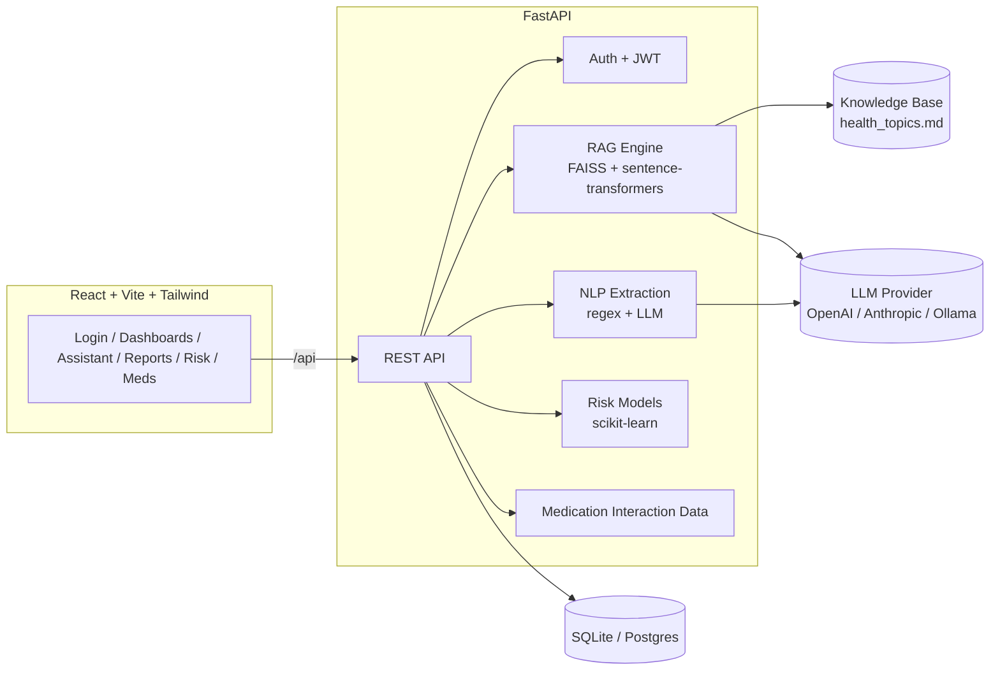

# MedVerse AI — Clinical Intelligence Platform

**Links:** [GitHub](https://github.com/paulelisha500-ops/medverse-ai) · [Hugging Face](https://huggingface.co/Elisha622/medverse-ai)

[](https://github.com/paulelisha500-ops/medverse-ai/actions/workflows/ci.yml)

A full-stack healthcare AI platform centered on **Retrieval-Augmented Generation, LLMs, and NLP**: a
grounded clinical/patient assistant, medical report understanding, predictive risk scoring, and a
medication interaction checker — behind real authentication and role-based dashboards for admins,
doctors, and patients.

> **This application does not provide medical advice, diagnosis, or treatment**, and should not be
> used to make real clinical decisions. See [Disclaimer](#disclaimer).

## Features

| Module | What it does |
|---|---|
| **Auth & roles** | JWT login/register, 3 roles (admin / doctor / patient), protected routes |
| **RAG AI Assistant** | Sentence-transformer embeddings + FAISS retrieval over a health knowledge base, fed into a pluggable LLM. Answers show their sources. Doctors can ask questions "with patient context," fusing retrieved record data into the prompt. If the embedding model can't be loaded (e.g. the Hugging Face Hub is unreachable), retrieval falls back to TF-IDF keyword search instead of failing |
| **Report Understanding (NLP)** | Lab values extracted by pattern matching and flagged against adult reference ranges (SI units detected and converted). With zero API keys, built-in clinical rules extract medications (with dose and frequency, skipping allergies and stopped drugs), conditions (skipping negated and family-history mentions) and follow-up, and write patient/clinical summaries; a configured LLM takes over those parts, and the rules remain the fallback if it fails |
| **Disease Risk Prediction** | Two real `scikit-learn` logistic regression models (diabetes, heart disease) trained on synthetic data at first run, with coefficient-based "top contributing factor" explainability |
| **Medication Interaction Checker** | Pairwise lookup against a curated set of well-established drug interactions |
| **Dashboards** | Role-aware stats and charts (admin: platform-wide; doctor: patient panel; patient: personal summary) |
| **Patient records** | CRUD medical history entries (conditions, medications, labs, visits, vaccinations) |

**Deliberately out of scope** (to keep the RAG/LLM/NLP core deep instead of shallow): medical
imaging/computer vision, wearable device integration, hospital bed/ICU management, and a mobile
app. See [Roadmap](#roadmap--natural-extensions).

## Architecture


```mermaid
flowchart LR
    subgraph Frontend [React + Vite + Tailwind]
        UI[Login / Dashboards / Assistant / Reports / Risk / Meds]
    end

    subgraph Backend [FastAPI]
        Auth[Auth + JWT]
        API[REST API]
        RAG[RAG Engine\nFAISS + sentence-transformers]
        NLP[NLP Extraction\nregex + LLM]
        ML[Risk Models\nscikit-learn]
        MedDB[Medication Interaction Data]
    end

    LLM[(LLM Provider\nOpenAI / Anthropic / Ollama)]
    DB[(SQLite / Postgres)]
    KB[(Knowledge Base\nhealth_topics.md)]

    UI -->|/api| API
    API --> Auth
    API --> RAG
    API --> NLP
    API --> ML
    API --> MedDB
    RAG --> KB
    RAG --> LLM
    NLP --> LLM
    API --> DB
```

## Tech stack

- **Frontend:** React 18 (Vite), React Router, Tailwind CSS, Axios, Recharts, lucide-react
- **Backend:** FastAPI, SQLAlchemy (SQLite by default, swap to Postgres via `DATABASE_URL`), JWT
  auth (`python-jose` + `passlib`/bcrypt)
- **RAG:** `sentence-transformers` embeddings + `faiss-cpu` vector search over an original,
  hand-written health knowledge base
- **LLM:** pluggable provider — OpenAI, Anthropic, or local Ollama. With none configured, the
  assistant still returns the most relevant retrieved knowledge-base context directly.
- **Predictive ML:** `scikit-learn` logistic regression, trained on synthetic data at first run
- **Deployment:** Docker + Docker Compose

## Quick start (Docker — recommended)

```bash
cp backend/.env.example backend/.env
# REQUIRED: set SECRET_KEY in backend/.env (the app refuses to start without one):
#   python -c "import secrets; print(secrets.token_hex(32))"
# optional: edit backend/.env to add an OpenAI/Anthropic key, or leave LLM_PROVIDER=none
docker compose up --build
```

- Frontend: http://localhost:3004
- Backend API docs (Swagger): http://localhost:8004/docs

First backend startup will train the risk models and build the RAG index automatically (the
embedding model downloads once, ~90MB).

## Quick start (manual / local dev)

**Backend**
```bash
cd backend
python3 -m venv venv && source venv/bin/activate   # Windows: venv\Scripts\activate
pip install -r requirements.txt
cp .env.example .env
uvicorn app.main:app --reload --port 8004
```

**Frontend** (in a second terminal)
```bash
cd frontend
npm install
npm run dev
```
Open http://localhost:5173 — the Vite dev server proxies `/api` to `http://localhost:8004`, so
there's no CORS configuration to fight with.

## Seeded accounts

Created automatically on first run:

| Role | Email | Password |
|---|---|---|
| Admin | `admin@medverse.ai` | `Admin@123` |
| Doctor | `doctor@medverse.ai` | `Doctor@123` |
| Patient | `patient@medverse.ai` | `Patient@123` |

Change or remove these before deploying anywhere public.

## Connecting an LLM provider

The app works with **zero API keys** (`LLM_PROVIDER=none` in `backend/.env`): the RAG assistant
still retrieves and surfaces the most relevant knowledge-base passages, just without free-form
generation. To unlock full AI-generated answers, set one of:

```bash
LLM_PROVIDER=openai        # + OPENAI_API_KEY
LLM_PROVIDER=anthropic     # + ANTHROPIC_API_KEY
LLM_PROVIDER=ollama        # run Ollama locally, no key needed — https://ollama.com
```

Adding a new provider is a matter of implementing one class in
`backend/app/rag/llm_providers.py` — see `LLMProvider`.

## Environment variables (backend/.env)

| Variable | Default | Notes |
|---|---|---|
| `SECRET_KEY` | — | Set to a long random string |
| `DATABASE_URL` | `sqlite:///./data/medverse.db` | Swap for a Postgres URL to scale up |
| `LLM_PROVIDER` | `none` | `openai` \| `anthropic` \| `ollama` \| `none` |
| `OPENAI_API_KEY` / `OPENAI_MODEL` | — / `gpt-4o-mini` | |
| `ANTHROPIC_API_KEY` / `ANTHROPIC_MODEL` | — / `claude-sonnet-5` | |
| `OLLAMA_BASE_URL` / `OLLAMA_MODEL` | `http://localhost:11434` / `llama3.1` | |
| `EMBEDDING_MODEL` | `sentence-transformers/all-MiniLM-L6-v2` | Downloaded on first run |
| `CORS_ORIGINS` | localhost:5173,3004 | Only needed if you bypass the Vite/nginx proxy |

## Project structure

```
medverse-ai/
├── backend/
│   └── app/
│       ├── main.py            # FastAPI app, startup: DB + seed + RAG index + risk models
│       ├── core/               # config, security (JWT/hashing)
│       ├── db/                 # SQLAlchemy models, session, sample data seed
│       ├── api/                 # auth, patients, assistant, reports, risk, medications, dashboard
│       ├── rag/                 # vector store (FAISS), LLM providers, knowledge base
│       ├── ml/                  # synthetic-data risk model training + inference
│       └── nlp/                 # lab-value regex extraction, medication interaction data
└── frontend/
    └── src/
        ├── context/AuthContext.jsx
        ├── components/          # Layout, ProtectedRoute, shared UI primitives
        └── pages/                # Login, Register, Dashboard, Assistant, Reports, RiskCheck, ...
```

## Running the tests

```bash
cd backend
pip install -r requirements-dev.txt
python -m pytest
```

The suite pins `LLM_PROVIDER=none`, uses a throwaway SQLite database, and stubs the live
openFDA/RxNorm lookups, so it never makes paid or network-dependent calls for those. GitHub
Actions ([`.github/workflows/ci.yml`](.github/workflows/ci.yml)) runs it on every push and pull
request, builds the frontend, and builds the Hugging Face Space image from the root `Dockerfile`,
boots it the way a Space does (port 7860, no `SECRET_KEY`, non-root) and smoke-tests it.

## Deploying to Hugging Face Spaces

Deployment runs through GitHub Actions
([`.github/workflows/sync-huggingface.yml`](.github/workflows/sync-huggingface.yml)). After CI
passes on `main` it:

1. mirrors `main` to the [model repo](https://huggingface.co/Elisha622/medverse-ai);
2. creates the Space on the first run (Docker, **private**, with a random `SECRET_KEY` secret so
   logins survive restarts) and uploads the same code. Hugging Face hosts Docker Spaces only for
   [PRO](https://huggingface.co/pro) accounts; on a free account this step is skipped with a
   warning, the model repo is still synced, and the Space is created on the first run after
   upgrading;
3. waits for the Space to build, then smoke-tests the live Space: health, frontend routing, the
   path-traversal fix, login, report analysis and the assistant.

One-time setup: create a Hugging Face token with write access
(<https://huggingface.co/settings/tokens>; for a fine-grained token tick *Write access to
contents/settings of all repos under your personal namespace*) and add it as the `HF_TOKEN`
repository secret under **Settings → Secrets and variables → Actions**. To run it on demand:
**Actions → Sync to Hugging Face → Run workflow**.

The YAML header at the top of this README is the Space configuration (`sdk: docker`,
`app_port: 7860`), and the root `Dockerfile` builds one container that serves both the API and the
built frontend. To use an LLM, add its key (e.g. `ANTHROPIC_API_KEY`) as a Space secret and
`LLM_PROVIDER` as a Space variable. `GET /api/health` reports `"retrieval": "semantic"` once the
embedding model has loaded, or `"keyword"` if it fell back.

The seeded accounts' passwords are published above and the app has no password change yet, so keep
the Space private: on a public Space anyone could sign in as the admin.

## Extending the knowledge base

Add a new section to `backend/app/rag/knowledge_base/health_topics.md` using the same
`# TOPIC: Title` format, delete `backend/data/kb_index.faiss` and `kb_chunks.json`, and restart —
the index rebuilds automatically.

## Roadmap / natural extensions

- Medical image analysis (chest X-ray / skin lesion / diabetic retinopathy classifiers)
- Wearable device integration and abnormal vitals alerting
- Hospital operations: bed/ICU occupancy, staff scheduling
- Flutter mobile app
- Swap SQLite → Postgres + Alembic migrations for production use

## Disclaimer

MedVerse AI is **not a certified medical device** and does not provide medical advice, diagnosis,
or treatment. All AI-generated content should be treated as general educational information only.
Always consult a licensed healthcare professional for real medical decisions.

## License

MIT — see [LICENSE](./LICENSE).
