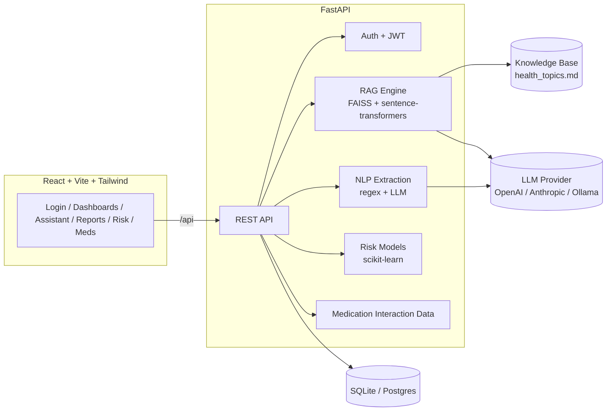

# MedVerse AI — Clinical Intelligence Platform

**Use it now, nothing to install:** [Hugging Face Space](https://huggingface.co/spaces/Elisha622/medverse-ai) ·
[GitHub Pages](https://paulelisha500-ops.github.io/medverse-ai/)

**Code:** [GitHub](https://github.com/paulelisha500-ops/medverse-ai) · [Hugging Face mirror](https://huggingface.co/Elisha622/medverse-ai)

A full-stack healthcare AI platform centered on **Retrieval-Augmented Generation, LLMs, and NLP**: a
grounded clinical/patient assistant, medical report understanding, predictive risk scoring, and a
medication interaction checker — behind real authentication and role-based dashboards for admins,
doctors, and patients.

> **This application does not provide medical advice, diagnosis, or treatment**, and should not be
> used to make real clinical decisions. See [Disclaimer](#disclaimer).

## Features

| Module | What it does |
|---|---|
| **Auth & roles** | JWT login/register, 3 roles (admin / doctor / patient), protected routes |
| **RAG AI Assistant** | Sentence-transformer embeddings + FAISS retrieval over a health knowledge base, fed into a pluggable LLM. Answers show their sources. Doctors can ask questions "with patient context," fusing retrieved record data into the prompt |
| **Report Understanding (NLP)** | Regex-based lab-value extraction (a real pattern-matching component, works with zero API keys) + LLM-based diagnosis/medication extraction and dual patient/clinical summaries |
| **Disease Risk Prediction** | Two real `scikit-learn` logistic regression models (diabetes, heart disease) trained on synthetic data at first run, with coefficient-based "top contributing factor" explainability |
| **Medication Interaction Checker** | Live check of official FDA drug labels (openFDA) with RxNorm name resolution, backed by 230 hand-reviewed interaction pairs; brand names and typos resolve to generics. Plus an equivalent-dose converter (opioids, corticosteroids, benzodiazepines) |
| **Dashboards** | Role-aware stats and charts (admin: platform-wide; doctor: patient panel; patient: personal summary) |
| **Patient records** | CRUD medical history entries (conditions, medications, labs, visits, vaccinations) |

## Two editions

| | Browser edition | Full stack |
|---|---|---|
| **Where** | [Hugging Face Space](https://huggingface.co/spaces/Elisha622/medverse-ai), [GitHub Pages](https://paulelisha500-ops.github.io/medverse-ai/), or any static host | Your machine or server, with Docker or manually |
| **Install** | Nothing: open the link | Python and Node, or Docker |
| **Data** | Stored in the visitor's browser | SQLite (or Postgres) |
| **Assistant** | all-MiniLM-L6-v2 on the device (Transformers.js); answers quote the retrieved passages | sentence-transformers + FAISS, with a pluggable LLM |
| **Reports** | Lab values, diagnoses, medications and both summaries produced on the device | Regex lab values, plus the configured LLM |

Both run the same React pages. In the browser edition, `frontend/src/browser/` implements every
`/api` route inside the page and `api/client.js` hands requests to it instead of the network.
Risk models, the drug directory, interaction pairs, dose tables and the knowledge base (with its
embeddings) are exported from the Python code by `backend/scripts/export_browser_data.py`, and
`backend/tests/test_browser_export.py` fails if that export falls out of date, so both editions
give the same results.

Run the browser edition locally:

```bash
cd frontend
npm install
npm run dev:browser        # or: npm run build:browser && npm run preview:browser
```

`.github/workflows/deploy.yml` builds it on every push to `main` and publishes it to GitHub Pages
and the Hugging Face Space, then mirrors the repository to the Hugging Face model repo. It needs a
repository secret `HF_TOKEN` holding a Hugging Face token with write access.

**Deliberately out of scope** (to keep the RAG/LLM/NLP core deep instead of shallow): medical
imaging/computer vision, wearable device integration, hospital bed/ICU management, and a mobile
app. See [Roadmap](#roadmap--natural-extensions).

## Architecture


```mermaid
flowchart LR
    subgraph Frontend [React + Vite + Tailwind]
        UI[Login / Dashboards / Assistant / Reports / Risk / Meds]
    end

    subgraph Backend [FastAPI]
        Auth[Auth + JWT]
        API[REST API]
        RAG[RAG Engine\nFAISS + sentence-transformers]
        NLP[NLP Extraction\nregex + LLM]
        ML[Risk Models\nscikit-learn]
        MedDB[Medication Interaction Data]
    end

    LLM[(LLM Provider\nOpenAI / Anthropic / Ollama)]
    DB[(SQLite / Postgres)]
    KB[(Knowledge Base\nhealth_topics.md)]

    UI -->|/api| API
    API --> Auth
    API --> RAG
    API --> NLP
    API --> ML
    API --> MedDB
    RAG --> KB
    RAG --> LLM
    NLP --> LLM
    API --> DB
```

## Tech stack

- **Frontend:** React 18 (Vite), React Router, Tailwind CSS, Axios, Recharts, lucide-react
- **Backend:** FastAPI, SQLAlchemy (SQLite by default, swap to Postgres via `DATABASE_URL`), JWT
  auth (`python-jose` + `passlib`/bcrypt)
- **RAG:** `sentence-transformers` embeddings + `faiss-cpu` vector search over an original,
  hand-written health knowledge base
- **LLM:** pluggable provider — OpenAI, Anthropic, or local Ollama. With none configured, the
  assistant still returns the most relevant retrieved knowledge-base context directly.
- **Predictive ML:** `scikit-learn` logistic regression, trained on synthetic data at first run
- **Browser edition:** Transformers.js (ONNX Runtime Web) for on-device embeddings, WebCrypto
  (PBKDF2) password hashing, browser storage
- **Deployment:** Docker + Docker Compose; GitHub Actions to GitHub Pages and Hugging Face Spaces

## Quick start (Docker — recommended)

```bash
cp backend/.env.example backend/.env
# REQUIRED: set SECRET_KEY in backend/.env (the app refuses to start without one):
#   python -c "import secrets; print(secrets.token_hex(32))"
# optional: edit backend/.env to add an OpenAI/Anthropic key, or leave LLM_PROVIDER=none
docker compose up --build
```

- Frontend: http://localhost:3004
- Backend API docs (Swagger): http://localhost:8004/docs

First backend startup will train the risk models and build the RAG index automatically (the
embedding model downloads once, ~90MB).

## Quick start (manual / local dev)

**Backend**
```bash
cd backend
python3 -m venv venv && source venv/bin/activate   # Windows: venv\Scripts\activate
pip install -r requirements.txt
cp .env.example .env
uvicorn app.main:app --reload --port 8004
```

**Frontend** (in a second terminal)
```bash
cd frontend
npm install
npm run dev
```
Open http://localhost:5173 — the Vite dev server proxies `/api` to `http://localhost:8004`, so
there's no CORS configuration to fight with.

## Seeded accounts

Created automatically on first run:

| Role | Email | Password |
|---|---|---|
| Admin | `admin@medverse.ai` | `Admin@123` |
| Doctor | `doctor@medverse.ai` | `Doctor@123` |
| Patient | `patient@medverse.ai` | `Patient@123` |

Change or remove these before deploying the full stack anywhere public. In the browser edition
they exist only inside each visitor's own browser, and the sign-in screen offers them as one-click
sign-ins.

## Connecting an LLM provider

The app works with **zero API keys** (`LLM_PROVIDER=none` in `backend/.env`): the RAG assistant
still retrieves and surfaces the most relevant knowledge-base passages, just without free-form
generation. To unlock full AI-generated answers, set one of:

```bash
LLM_PROVIDER=openai        # + OPENAI_API_KEY
LLM_PROVIDER=anthropic     # + ANTHROPIC_API_KEY
LLM_PROVIDER=ollama        # run Ollama locally, no key needed — https://ollama.com
```

Adding a new provider is a matter of implementing one class in
`backend/app/rag/llm_providers.py` — see `LLMProvider`.

## Environment variables (backend/.env)

| Variable | Default | Notes |
|---|---|---|
| `SECRET_KEY` | — | Set to a long random string |
| `DATABASE_URL` | `sqlite:///./data/medverse.db` | Swap for a Postgres URL to scale up |
| `LLM_PROVIDER` | `none` | `openai` \| `anthropic` \| `ollama` \| `none` |
| `OPENAI_API_KEY` / `OPENAI_MODEL` | — / `gpt-4o-mini` | |
| `ANTHROPIC_API_KEY` / `ANTHROPIC_MODEL` | — / `claude-sonnet-5` | |
| `OLLAMA_BASE_URL` / `OLLAMA_MODEL` | `http://localhost:11434` / `llama3.1` | |
| `EMBEDDING_MODEL` | `sentence-transformers/all-MiniLM-L6-v2` | Downloaded on first run |
| `CORS_ORIGINS` | localhost:5173,3004 | Only needed if you bypass the Vite/nginx proxy |

## Project structure

```
medverse-ai/
├── .github/workflows/deploy.yml   # browser edition -> GitHub Pages + Hugging Face
├── deploy/huggingface/          # Space card + publish script
├── backend/
│   ├── scripts/export_browser_data.py   # data for the browser edition
│   └── app/
│       ├── main.py            # FastAPI app, startup: DB + seed + RAG index + risk models
│       ├── core/               # config, security (JWT/hashing)
│       ├── db/                 # SQLAlchemy models, session, sample data seed
│       ├── api/                 # auth, patients, assistant, reports, risk, medications, dashboard
│       ├── rag/                 # vector store (FAISS), LLM providers, knowledge base
│       ├── ml/                  # synthetic-data risk model training + inference
│       └── nlp/                 # lab-value regex extraction, medication interaction data
└── frontend/
    └── src/
        ├── browser/             # the API, reimplemented to run in the page (browser edition)
        ├── context/AuthContext.jsx
        ├── components/          # Layout, ProtectedRoute, shared UI primitives
        └── pages/                # Login, Register, Dashboard, Assistant, Reports, RiskCheck, ...
```

## Extending the knowledge base

Add a new section to `backend/app/rag/knowledge_base/health_topics.md` using the same
`# TOPIC: Title` format and restart the backend; the index notices the change and rebuilds
automatically. Then run `python scripts/export_browser_data.py` from `backend/`
so the browser edition gets the new topic too.

## Roadmap / natural extensions

- Medical image analysis (chest X-ray / skin lesion / diabetic retinopathy classifiers)
- Wearable device integration and abnormal vitals alerting
- Hospital operations: bed/ICU occupancy, staff scheduling
- Flutter mobile app
- Swap SQLite → Postgres + Alembic migrations for production use

## Disclaimer

MedVerse AI is **not a certified medical device** and does not provide medical advice, diagnosis,
or treatment. All AI-generated content should be treated as general educational information only.
Always consult a licensed healthcare professional for real medical decisions.

## License

MIT — see [LICENSE](./LICENSE).
